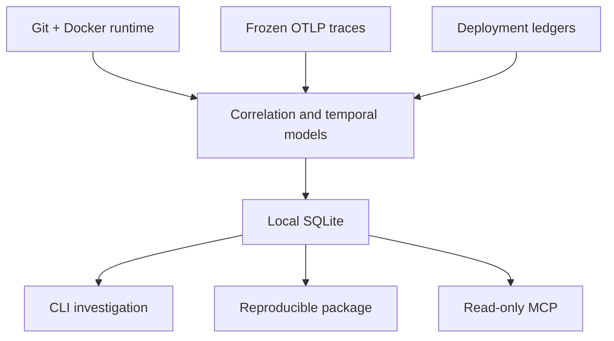

# Prodmap

English | [Português (Brasil)](README.pt-BR.md)

Prodmap is a local-first Go CLI that combines Git, Docker runtime, deployment,
and frozen OpenTelemetry trace evidence to help explain what was running and
what changed around a deployment.

It is an experimental side project. Correlation is not causation; insufficient
or incompatible evidence returns `UNKNOWN`; and `CANDIDATE` is not a confirmed
regression. Prodmap does not make health, causal, commercial, or product-thesis
claims.

## Why Prodmap?

Production investigations often require joining evidence recorded separately:
a Git revision, a container runtime, a deployment ledger, and a trace captured
in a bounded interval. Prodmap keeps those inputs local, records their evidence
boundaries, and returns a conservative view rather than an unsupported
explanation.

For example: **Checkout became slower after a deployment. What changed?**
Prodmap can select the deployment, compare bounded telemetry windows around it,
attach nearby topology and timeline evidence, and state the limitations of that
comparison.

## What the answer looks like

An investigation is structured evidence, not a verdict:

```text
Deployment: payment-api deployment UUID
Regression: CANDIDATE
Direction: INCREASE
Confidence: LOW
Causality claimed: false
```

`UNKNOWN` remains distinct from `LOW`; `NO_SIGNAL` does not mean healthy; and
`CANDIDATE` means conservative thresholds were met, not that a regression was
confirmed or caused by the deployment.

## Quickstart

Build the current source checkout, then initialize and diagnose a local project:

```bash
git clone git@github.com:guijoazeiro/prodmap.git
cd prodmap
make build
./bin/prodmap version
./bin/prodmap init
./bin/prodmap doctor
```

Ingest a frozen deployment ledger and trace JSONL, list deployments, and use
the returned internal deployment UUID for the temporal commands:

```bash
./bin/prodmap deployments ingest --file deployments.jsonl --json
./bin/prodmap telemetry ingest --file traces.otlp.jsonl \
  --environment reference --window-start <RFC3339> --window-end <RFC3339> --json
./bin/prodmap deploys --environment reference --json
./bin/prodmap regression --deployment <UUIDv7> --metric latency_p95 --json
./bin/prodmap investigate --deployment <UUIDv7> --metric latency_p95 --json
```

The UUID returned by `deploys` identifies the specific ledgered deployment for
regression and investigation. Docker is optional: it is needed only to collect
local runtime evidence with `runtime --refresh`.

## How it works



## Core workflows

- **Runtime provenance:** read local Docker runtime inventory without mutating
  containers, then correlate immutable runtime provenance with local Git
  evidence.
- **Frozen telemetry ingestion:** ingest OTLP trace JSONL, build observed
  service topology, endpoint windows, and a bounded timeline.
- **Deployment intelligence:** ingest a frozen deployment ledger or fetch and
  persist a verified GitHub Actions ledger artifact, then list deployments and
  their derived runtime context.
- **Baseline and regression:** calculate conservative prior and post-deployment
  windows and classify eligible comparisons as `CANDIDATE`, `NO_SIGNAL`, or
  `UNKNOWN`.
- **Investigation packages:** create a portable sanitized investigation ZIP and
  verify it offline.
- **MCP:** expose bounded deployment discovery and investigation through the
  read-only stdio tools `list_deployments` and `investigate_deployment`.

Prodmap ingests frozen OTLP traces only. Metrics and logs ingestion, a live
receiver, causal scoring, and generic export are out of scope.

## Installation and requirements

- Go 1.26.6 or newer in the Go 1.26 line.
- GNU Make for the documented build and test shortcuts.
- Docker is optional and only needed for `runtime --refresh`.

There are no release binaries yet. Build the current source checkout with
`make build`; use `./bin/prodmap <command> --help` for the full flag contract.

## Additional local evidence queries

Refresh local runtime evidence when Docker is available, then inspect known
services:

```bash
./bin/prodmap runtime --refresh --environment reference
./bin/prodmap services --json
```

Query observed topology at a reproducible instant:

```bash
./bin/prodmap graph \
  --service checkout-api \
  --environment reference \
  --at <RFC3339> \
  --json
```

All examples use local files and SQLite. Docker is not required after runtime
evidence has been captured.

## Reproducible investigation packages

Create a portable package from the same read-only investigation composition, then verify it offline:

```bash
./bin/prodmap package create \
  --deployment <UUIDv7> --metric latency_p95 --output investigation.zip --json
./bin/prodmap package verify --file investigation.zip --json
```

The ZIP contains exactly `manifest.json`, `investigation.json`, and `SHA256SUMS`. Verification checks the closed file inventory, hashes, duplicate-free strict JSON, semantic consistency, size limits, and redaction. It validates integrity and analytical coherence, not a signature or proof of authorship/authenticity.

## Commands

| Command | Purpose |
| --- | --- |
| `init` | Create local configuration and SQLite state. |
| `doctor` | Check local configuration and optional dependencies. |
| `status` | Summarize local inventory state. |
| `runtime` | Query or refresh local Docker runtime evidence. |
| `services` | List observed services and runtime associations. |
| `explain` | Explain stored provenance or correlation evidence. |
| `telemetry ingest` | Ingest frozen OTLP trace JSONL. |
| `graph` | Read observed service topology. |
| `endpoints` | Read endpoint-level telemetry windows. |
| `deployments ingest` | Ingest a frozen deployment ledger. |
| `deployments sync github-actions` | Fetch and persist a verified GitHub Actions ledger artifact. |
| `deploys` | List deployments and derived runtime context. |
| `timeline` | Read deployment and runtime events in time order. |
| `baseline` | Evaluate one prior telemetry window. |
| `regression` | Compare before/after windows around a deployment. |
| `investigate` | Compose regression, topology, timeline, and evidence references. |
| `package create` | Write a sanitized, verifiable investigation ZIP. |
| `package verify` | Verify an investigation ZIP offline. |
| `mcp serve` | Serve `list_deployments` and `investigate_deployment` over stdio. |

Use `./bin/prodmap <command> --help` for the full flag contract.

## Configuration and inputs

`init` creates project configuration at `.prodmap/config.yaml` and SQLite data at `.prodmap/prodmap.db`. `--data-dir` is the path to the SQLite file despite its historic flag name, not a directory.

Configuration precedence is: command flags, environment variables, project configuration, user configuration, then defaults. Supported variables are:

- `PRODMAP_PROJECT_DIR`
- `PRODMAP_DATA_DIR`
- `PRODMAP_LOG_LEVEL`
- `PRODMAP_LOG_FORMAT`

Input contracts and examples are documented in the [deployment ledger contract](docs/contracts/deployment-ledger-jsonl-v1.md), [OTLP ingestion ADR](docs/adr/016-otel-ingestion-format.md), and [Phase 2A JSON examples](docs/phase-2a-json-examples.md).

## MCP configuration and agent workflow

Run the MCP server over stdio:

```bash
./bin/prodmap mcp serve \
  --project-dir /absolute/path/to/project
```

Example generic MCP client configuration:

```json
{
  "mcpServers": {
    "prodmap": {
      "command": "/absolute/path/to/prodmap",
      "args": ["mcp", "serve", "--project-dir", "/absolute/path/to/project"]
    }
  }
}
```

The server exposes exactly two tools: `list_deployments` and
`investigate_deployment`. Use discovery to obtain an internal deployment UUID,
then pass it to the investigation tool. `list_deployments` accepts bounded
environment, service, status, time-window, limit, and opaque-cursor filters;
it defaults to the prior 24 hours and returns only a sanitized deployment
projection. Both tools use stdio, open no HTTP port, accept no arbitrary paths,
are read-only, and never return raw sources. MCP requires an already
initialized, schema-compatible inventory: it opens SQLite with `mode=ro`, never
creates a database or runs migrations, and a compatible inventory must be
updated by an authorized write command outside MCP. Its confidence carries
limitations and always declares `causality_claimed: false`.

[Decision 005](docs/decisions/005-bounded-mcp-deployment-discovery.md) and
[ADR-033](docs/adr/033-mcp-deployment-discovery.md) record the limited v0.3
addition of `list_deployments`, released as `v0.3.0-mcp-discovery`. The server
gains no writes, network access, remote sources, or other MCP tools.

The agent flow is `list_deployments` with safe filters, select an item’s
`deployment_id`, then call `investigate_deployment` with that UUID and metric.

## Semantics and safety

- `UNKNOWN` is not `LOW`; it represents insufficient or incompatible evidence.
- Correlation does not establish causation, and absence of evidence is not negative evidence.
- Mutable tags are not immutable artifact identity.
- `CANDIDATE` is not confirmed; `NO_SIGNAL` is not a health claim.
- Investigation, package, and MCP outputs never expose raw Docker inspection, secrets, HTTP bodies, raw telemetry, ledger source records, image references, or Git SHAs.

## Development and testing

```bash
make dev
make build
make test
go test -race ./...
```

`make dev` uses the Air version pinned in `go.mod` for local hot reload. It is a development convenience, not a production runtime component.

Normal tests do not require Docker. `make test-integration` is opt-in and
requires Docker plus Compose; it creates only isolated test resources, exercises
the Docker runtime source and the pinned Collector OTLP path, and does not use
the reference application. CI runs it on pushes to `dev` and `main`, `v*` tags,
and manual dispatches—not on pull requests.

### Opt-in model-driven MCP validation

Run the local E2E MCP agent check only when intentionally validating the
model/tool interaction:

```bash
make test-mcp-agent
```

It uses the locally authenticated Codex CLI and therefore can consume Codex
usage. The runner creates an isolated SQLite fixture, has GPT-5.6 Terra
discover a `payment-api` deployment through `list_deployments`, then calls
`investigate_deployment`, and validates a structured `CANDIDATE` result without
causality. This real eval is probabilistic, opt-in, and not a release gate or
CI job. A model can end after `list_deployments`; Terra Medium and High have
done so in recorded attempts. That trajectory failure does not imply an MCP
server failure and is not success for the full agent flow. `make test-scripts`
runs the deterministic shell validation in CI. To sample bounded variation:

```bash
MCP_AGENT_RUNS=3 \
MCP_AGENT_MODEL=gpt-5.6-terra \
MCP_AGENT_REASONING_EFFORT=medium \
make test-mcp-agent
```

The model's wording can vary; this check validates tool-use structure and
semantics rather than commercial accuracy. Deterministic Go and shell tests
remain the primary regression protection.

## Documentation

- [Product specification](docs/prodmap-product-spec-v2.md)
- [Technical specification](docs/prodmap-technical-spec-v1.md)
- [Architecture decisions](docs/adr/)
- [v0.3.1 final review](docs/reviews/v0.3-final-review.md)
- [Deployment ledger contract](docs/contracts/deployment-ledger-jsonl-v1.md)
- [OTLP trace examples](docs/phase-2a-json-examples.md)
- [Reference application](https://github.com/guijoazeiro/prodmap-reference-app)
- [Experiment 001 protocol](docs/experiments/001-correlation-vs-raw-context.md)

## Short history

Foundation through Phase 4 established local provenance, observed topology,
deployment context, conservative regression, and a limited technical
validation. Decision 004 authorizes the bounded technical evolution of Phases
5 and 6: investigation view, reproducible package, and minimal read-only MCP.
Decision 005 subsequently authorized and Slice 6.1 implemented v0.3 bounded
`list_deployments` discovery alongside `investigate_deployment`, released as
`v0.3.0-mcp-discovery`. This remains an engineering side project; product
accuracy, calibration, and the original commercial thesis are still
inconclusive.
