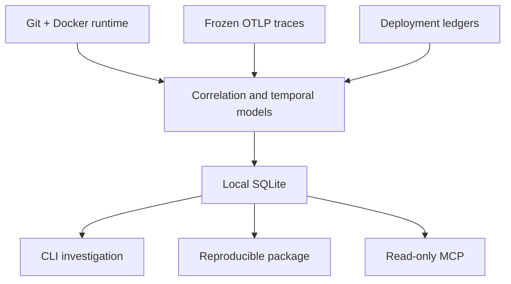

# Prodmap

Prodmap is a local-first Go CLI that correlates source revisions, container images, runtime instances, deployments, and OpenTelemetry traces to give developers and coding agents structured production context.

It helps answer practical questions: which version is running, which commit produced an artifact, how services communicate, what changed around a deployment, whether behavior changed, and which evidence supports that view. Correlation is evidence, not causation.

## Status

Prodmap is an experimental side project. It is a functional local CLI backed by local SQLite, with a read-only stdio MCP server. It is not commercially validated. Analytical results can be `UNKNOWN`, `NO_SIGNAL`, or `CANDIDATE`; `CANDIDATE` is not confirmed and `NO_SIGNAL` does not mean healthy.

The project deliberately prefers explicit uncertainty over a persuasive but unsupported conclusion.

## How it works



## What it can do

- Initialize and diagnose a local project.
- Read local Docker runtime inventory without mutating containers.
- Correlate immutable runtime provenance with local Git evidence.
- Ingest frozen OTLP trace JSONL and build observed service topology.
- Ingest deployment ledgers, list deployments, and build a timeline.
- Calculate conservative baseline and deployment-centered regression views.
- Classify eligible regressions as `CANDIDATE`, `NO_SIGNAL`, or `UNKNOWN`.
- Compose a sanitized, agent-ready investigation view.
- Create and verify portable investigation packages, or expose investigations through one read-only MCP tool.

Prodmap ingests frozen OTLP traces only. Metrics and logs ingestion, a live receiver, causal scoring, and generic export are out of scope.

## Requirements

- Go 1.26.6 or newer in the Go 1.26 line.
- GNU Make for the documented build and test shortcuts.
- Docker is optional and only needed for `runtime --refresh`.

## Install from source

There are no release binaries yet. Build the current source checkout:

```bash
git clone git@github.com:guijoazeiro/prodmap.git
cd prodmap
make build
./bin/prodmap version
```

## Quickstart

Start with an empty local project:

```bash
./bin/prodmap init
./bin/prodmap doctor
```

Refresh local runtime evidence when Docker is available, then inspect known services:

```bash
./bin/prodmap runtime --refresh --environment reference
./bin/prodmap services --json
```

Ingest a frozen trace file for a bounded time window. The input is one OTLP `ExportTraceServiceRequest` JSON object per JSONL line:

```bash
./bin/prodmap telemetry ingest \
  --file traces.otlp.jsonl \
  --environment reference \
  --window-start <RFC3339> \
  --window-end <RFC3339> \
  --json
```

Query observed topology at a reproducible instant:

```bash
./bin/prodmap graph \
  --service checkout-api \
  --environment reference \
  --at <RFC3339> \
  --json
```

Ingest a deployment ledger and find the deployment UUID used by the temporal commands:

```bash
./bin/prodmap deployments ingest --file deployments.jsonl --json
./bin/prodmap deploys --environment reference --json
```

Compare behavior around a deployment, then compose the agent-facing view. Replace `<UUIDv7>` with the deployment ID returned by `deploys`:

```bash
./bin/prodmap regression --deployment <UUIDv7> --metric latency_p95 --json
./bin/prodmap investigate --deployment <UUIDv7> --metric latency_p95 --json
```

All examples use local files and SQLite. Docker is not required after runtime evidence has been captured.

## Reproducible investigation packages

Create a portable package from the same read-only investigation composition, then verify it offline:

```bash
./bin/prodmap package create \
  --deployment <UUIDv7> --metric latency_p95 --output investigation.zip --json
./bin/prodmap package verify --file investigation.zip --json
```

The ZIP contains exactly `manifest.json`, `investigation.json`, and `SHA256SUMS`. Verification checks the closed file inventory, hashes, strict JSON, consistency, size limits, and redaction. This provides integrity checking, not a signature or proof of authorship/authenticity.

## Read-only MCP

Run the MCP server over stdio:

```bash
./bin/prodmap mcp serve \
  --project-dir /absolute/path/to/project
```

Example generic MCP client configuration:

```json
{
  "mcpServers": {
    "prodmap": {
      "command": "/absolute/path/to/prodmap",
      "args": ["mcp", "serve", "--project-dir", "/absolute/path/to/project"]
    }
  }
}
```

The server exposes exactly one tool: `investigate_deployment`. It requires a deployment UUIDv7 and a metric (`request_count`, `error_rate`, `latency_p50`, `latency_p95`, or `latency_p99`) and accepts optional before/after durations, minimum samples, and minimum coverage. It uses stdio, opens no HTTP port, accepts no arbitrary paths through the tool, is read-only, and never returns raw sources. Its confidence carries limitations and always declares `causality_claimed: false`.

## Commands

| Command | Purpose |
| --- | --- |
| `init` | Create local configuration and SQLite state. |
| `doctor` | Check local configuration and optional dependencies. |
| `status` | Summarize local inventory state. |
| `runtime` | Query or refresh local Docker runtime evidence. |
| `services` | List observed services and runtime associations. |
| `explain` | Explain stored provenance or correlation evidence. |
| `telemetry ingest` | Ingest frozen OTLP trace JSONL. |
| `graph` | Read observed service topology. |
| `endpoints` | Read endpoint-level telemetry windows. |
| `deployments ingest` | Ingest a frozen deployment ledger. |
| `deployments sync github-actions` | Fetch and persist a verified GitHub Actions ledger artifact. |
| `deploys` | List deployments and derived runtime context. |
| `timeline` | Read deployment and runtime events in time order. |
| `baseline` | Evaluate one prior telemetry window. |
| `regression` | Compare before/after windows around a deployment. |
| `investigate` | Compose regression, topology, timeline, and evidence references. |
| `package create` | Write a sanitized, verifiable investigation ZIP. |
| `package verify` | Verify an investigation ZIP offline. |
| `mcp serve` | Serve `investigate_deployment` over stdio. |

Use `./bin/prodmap <command> --help` for the full flag contract.

## Configuration and inputs

`init` creates project configuration at `.prodmap/config.yaml` and SQLite data at `.prodmap/prodmap.db`. `--data-dir` is the path to the SQLite file despite its historic flag name, not a directory.

Configuration precedence is: command flags, environment variables, project configuration, user configuration, then defaults. Supported variables are:

- `PRODMAP_PROJECT_DIR`
- `PRODMAP_DATA_DIR`
- `PRODMAP_LOG_LEVEL`
- `PRODMAP_LOG_FORMAT`

Input contracts and examples are documented in the [deployment ledger contract](docs/contracts/deployment-ledger-jsonl-v1.md), [OTLP ingestion ADR](docs/adr/016-otel-ingestion-format.md), and [Phase 2A JSON examples](docs/phase-2a-json-examples.md).

## Semantics and safety

- `UNKNOWN` is not `LOW`; it represents insufficient or incompatible evidence.
- Correlation does not establish causation, and absence of evidence is not negative evidence.
- Mutable tags are not immutable artifact identity.
- `CANDIDATE` is not confirmed; `NO_SIGNAL` is not a health claim.
- Investigation, package, and MCP outputs never expose raw Docker inspection, secrets, HTTP bodies, raw telemetry, ledger source records, image references, or Git SHAs.

## Development

```bash
make dev
make build
make test
go test -race ./...
```

`make dev` uses the Air version pinned in `go.mod` for local hot reload. It is a development convenience, not a production runtime component.

## Documentation

- [Product specification](docs/prodmap-product-spec-v2.md)
- [Technical specification](docs/prodmap-technical-spec-v1.md)
- [Architecture decisions](docs/adr/)
- [Deployment ledger contract](docs/contracts/deployment-ledger-jsonl-v1.md)
- [OTLP trace examples](docs/phase-2a-json-examples.md)
- [Reference application](https://github.com/guijoazeiro/prodmap-reference-app)
- [Experiment 001 protocol](docs/experiments/001-correlation-vs-raw-context.md)

## Short history

Foundation through Phase 4 established local provenance, observed topology, deployment context, conservative regression, and a limited technical validation. Decision 004 authorizes the bounded technical evolution of Phases 5 and 6: investigation view, reproducible package, and minimal read-only MCP. This remains an engineering side project; product accuracy, calibration, and the original product thesis are still inconclusive.
