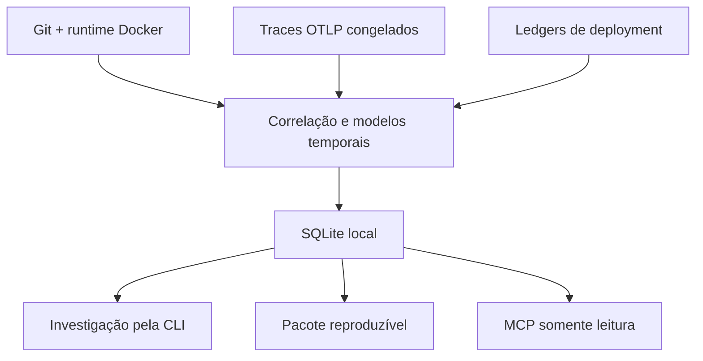

# Prodmap

[English](README.md) | Português (Brasil)

Prodmap é uma CLI Go local-first que combina evidências de Git, runtime Docker,
deployments e traces OpenTelemetry congelados para ajudar a explicar o que
estava em execução e o que mudou em torno de um deployment.

É um side project experimental. Correlação não implica causalidade; evidência
insuficiente ou incompatível retorna `UNKNOWN`; e `CANDIDATE` não é uma
regressão confirmada. O Prodmap não faz afirmações sobre saúde, causalidade,
aspectos comerciais ou a tese do produto.

## Por que Prodmap?

Investigações em produção frequentemente exigem unir evidências registradas em
separado: uma revisão Git, um runtime de contêiner, um ledger de deployment e
um trace capturado em um intervalo delimitado. O Prodmap mantém essas entradas
locais, registra os limites de suas evidências e retorna uma visão conservadora
em vez de uma explicação sem suporte.

Por exemplo: **o checkout ficou mais lento após um deployment. O que mudou?**
O Prodmap pode selecionar o deployment, comparar janelas de telemetria
delimitadas ao redor dele, associar evidências próximas de topologia e timeline
e informar as limitações dessa comparação.

## Como é a resposta

Uma investigação é evidência estruturada, não um veredito:

```text
Deployment: UUID do deployment payment-api
Regressão: CANDIDATE
Direção: INCREASE
Confiança: LOW
Causalidade declarada: false
```

`UNKNOWN` permanece distinto de `LOW`; `NO_SIGNAL` não significa saudável; e
`CANDIDATE` significa que os thresholds conservadores foram atendidos, não que
uma regressão foi confirmada ou causada pelo deployment.

## Início rápido

Compile o checkout atual do código-fonte, depois inicialize e diagnostique um
projeto local:

```bash
git clone git@github.com:guijoazeiro/prodmap.git
cd prodmap
make build
./bin/prodmap version
./bin/prodmap init
./bin/prodmap doctor
```

Ingira um ledger de deployment congelado e um JSONL de traces congelados, liste
os deployments e use o UUID interno retornado nos comandos temporais:

```bash
./bin/prodmap deployments ingest --file deployments.jsonl --json
./bin/prodmap telemetry ingest --file traces.otlp.jsonl \
  --environment reference --window-start <RFC3339> --window-end <RFC3339> --json
./bin/prodmap deploys --environment reference --json
./bin/prodmap regression --deployment <UUIDv7> --metric latency_p95 --json
./bin/prodmap investigate --deployment <UUIDv7> --metric latency_p95 --json
```

O UUID retornado por `deploys` identifica o deployment específico registrado no
ledger para regressão e investigação. Docker é opcional: ele só é necessário
para coletar evidência local de runtime com `runtime --refresh`.

## Como funciona



O Prodmap usa somente traces OTLP congelados; ele não recebe telemetria ao
vivo. Ingestão de métricas e logs, um receiver ativo, score causal e exportação
genérica estão fora do escopo.

## Fluxos centrais

- **Proveniência de runtime:** lê o inventário local de runtime Docker sem
  alterar contêineres e correlaciona proveniência de runtime imutável com
  evidência Git local.
- **Ingestão de telemetria congelada:** ingere JSONL de traces OTLP, constrói
  topologia observada de serviços, janelas de endpoints e uma timeline
  delimitada.
- **Inteligência de deployment:** ingere um ledger de deployment congelado ou
  busca e persiste um artefato de ledger verificado do GitHub Actions; então
  lista deployments e seu contexto de runtime derivado.
- **Baseline e regressão:** calcula janelas conservadoras anteriores e
  posteriores ao deployment e classifica comparações elegíveis como
  `CANDIDATE`, `NO_SIGNAL` ou `UNKNOWN`.
- **Pacotes de investigação:** cria um ZIP de investigação portátil e
  sanitizado e o verifica offline.
- **MCP:** expõe descoberta de deployments e investigação delimitadas por meio
  das tools stdio somente leitura `list_deployments` e
  `investigate_deployment`.

## Instalação e requisitos

- Go 1.26.6 ou superior na linha Go 1.26.
- GNU Make para os atalhos documentados de build e testes.
- Docker é opcional e necessário apenas para `runtime --refresh`.

Ainda não há binários de release. Compile o checkout atual com `make build`;
use `./bin/prodmap <command> --help` para o contrato completo de flags.

## Consultas adicionais de evidência local

Atualize evidência local de runtime quando Docker estiver disponível e então
inspecione os serviços conhecidos:

```bash
./bin/prodmap runtime --refresh --environment reference
./bin/prodmap services --json
```

Consulte a topologia observada em um instante reproduzível:

```bash
./bin/prodmap graph \
  --service checkout-api \
  --environment reference \
  --at <RFC3339> \
  --json
```

Todos os exemplos usam arquivos locais e SQLite. Docker não é necessário após
a captura da evidência de runtime.

## Pacotes de investigação reproduzíveis

Crie um pacote portátil a partir da mesma composição de investigação somente
leitura e então verifique-o offline:

```bash
./bin/prodmap package create \
  --deployment <UUIDv7> --metric latency_p95 --output investigation.zip --json
./bin/prodmap package verify --file investigation.zip --json
```

O ZIP contém exatamente `manifest.json`, `investigation.json` e `SHA256SUMS`.
A verificação confere o inventário fechado de arquivos, hashes, JSON estrito sem
duplicatas, consistência semântica, limites de tamanho e redaction. Ela valida
integridade e coerência analítica, não uma assinatura ou prova de autoria ou
autenticidade.

## Referência de comandos

| Comando | Finalidade |
| --- | --- |
| `init` | Cria configuração local e estado SQLite. |
| `doctor` | Verifica a configuração local e dependências opcionais. |
| `status` | Resume o estado do inventário local. |
| `runtime` | Consulta ou atualiza evidência local de runtime Docker. |
| `services` | Lista serviços observados e associações de runtime. |
| `explain` | Explica evidência de proveniência ou correlação armazenada. |
| `telemetry ingest` | Ingere JSONL de traces OTLP congelados. |
| `graph` | Lê a topologia de serviços observada. |
| `endpoints` | Lê janelas de telemetria no nível de endpoint. |
| `deployments ingest` | Ingere um ledger de deployment congelado. |
| `deployments sync github-actions` | Busca e persiste um artefato de ledger verificado do GitHub Actions. |
| `deploys` | Lista deployments e contexto de runtime derivado. |
| `timeline` | Lê eventos de deployment e runtime em ordem temporal. |
| `baseline` | Avalia uma janela de telemetria anterior. |
| `regression` | Compara janelas antes/depois em torno de um deployment. |
| `investigate` | Compõe regressão, topologia, timeline e referências de evidência. |
| `package create` | Grava um ZIP de investigação sanitizado e verificável. |
| `package verify` | Verifica um ZIP de investigação offline. |
| `mcp serve` | Serve `list_deployments` e `investigate_deployment` via stdio. |

Use `./bin/prodmap <command> --help` para o contrato completo de flags.

## Configuração e contratos de entrada

`init` cria a configuração do projeto em `.prodmap/config.yaml` e os dados
SQLite em `.prodmap/prodmap.db`. `--data-dir` é o caminho para o arquivo SQLite,
apesar do nome histórico da flag; não é um diretório.

A precedência da configuração é: flags de comando, variáveis de ambiente,
configuração do projeto, configuração do usuário e, por fim, valores padrão.
As variáveis compatíveis são:

- `PRODMAP_PROJECT_DIR`
- `PRODMAP_DATA_DIR`
- `PRODMAP_LOG_LEVEL`
- `PRODMAP_LOG_FORMAT`

Contratos e exemplos de entrada estão documentados no [contrato do ledger de
deployment](docs/contracts/deployment-ledger-jsonl-v1.md), no [ADR de ingestão
OTLP](docs/adr/016-otel-ingestion-format.md) e nos [exemplos JSON da Phase
2A](docs/phase-2a-json-examples.md).

## Configuração MCP e fluxo do agente

Execute o servidor MCP via stdio:

```bash
./bin/prodmap mcp serve \
  --project-dir /absolute/path/to/project
```

Exemplo de configuração genérica de cliente MCP:

```json
{
  "mcpServers": {
    "prodmap": {
      "command": "/absolute/path/to/prodmap",
      "args": ["mcp", "serve", "--project-dir", "/absolute/path/to/project"]
    }
  }
}
```

O servidor expõe exatamente duas tools: `list_deployments` e
`investigate_deployment`. Use `list_deployments` com filtros seguros e
delimitados para obter um `deployment_id` interno sanitizado; então passe esse
UUID e uma métrica para `investigate_deployment`. O UUID do deployment é um
identificador interno para o deployment específico registrado no ledger; ele
permite que um agente solicite a investigação delimitada associada sem fornecer
fontes brutas ou paths arbitrários.

`list_deployments` aceita filtros delimitados de ambiente, serviço, status,
janela de tempo, limite e cursor opaco; por padrão, consulta as 24 horas
anteriores. As duas tools usam stdio, não abrem porta HTTP, não aceitam paths
arbitrários, são somente leitura e nunca retornam fontes brutas. MCP exige um
inventário já inicializado e compatível com o schema: ele abre SQLite com
`mode=ro`, nunca cria banco de dados nem executa migrations, e um inventário
compatível deve ser atualizado por um comando de escrita autorizado fora do MCP.
Sua confiança inclui limitações e sempre declara `causality_claimed: false`.

[Decision 005](docs/decisions/005-bounded-mcp-deployment-discovery.md) e
[ADR-033](docs/adr/033-mcp-deployment-discovery.md) registram a adição limitada
da v0.3 de `list_deployments`, lançada como `v0.3.0-mcp-discovery`. O servidor
não ganha escrita, acesso de rede, fontes remotas nem outras tools MCP.

O fluxo do agente é: usar `list_deployments` com filtros seguros, selecionar o
`deployment_id` de um item e chamar `investigate_deployment` com esse UUID e
uma métrica.

## Semântica e segurança

- `UNKNOWN` não é `LOW`; ele representa evidência insuficiente ou incompatível.
- Correlação não estabelece causalidade, e ausência de evidência não é
  evidência negativa.
- Tags mutáveis não são identidade imutável de artefato.
- `CANDIDATE` não é confirmado; `NO_SIGNAL` não é uma afirmação de saúde.
- Saídas de investigação, pacote e MCP nunca expõem inspeção Docker bruta,
  segredos, corpos HTTP, telemetria bruta, registros fonte do ledger, image
  references ou Git SHAs.

## Desenvolvimento e testes

```bash
make dev
make build
make test
go test -race ./...
```

`make dev` usa a versão do Air fixada em `go.mod` para hot reload local. É uma
conveniência de desenvolvimento, não um componente de runtime de produção.

Testes normais não exigem Docker. `make test-integration` é opt-in e requer
Docker mais Compose; ele cria apenas recursos de teste isolados, exercita a
fonte de runtime Docker e o caminho OTLP do Collector fixado, e não usa a
aplicação de referência. O CI o executa em pushes para `dev` e `main`, tags
`v*` e disparos manuais — não em pull requests.

### Validação MCP opt-in orientada por modelo

Execute a verificação local E2E do agente MCP somente ao validar
intencionalmente a interação modelo/tool:

```bash
make test-mcp-agent
```

Ela usa a CLI Codex autenticada localmente e, portanto, pode consumir uso do
Codex. O runner cria uma fixture SQLite isolada, faz GPT-5.6 Terra descobrir um
deployment `payment-api` via `list_deployments`, depois chamar
`investigate_deployment` e valida um resultado `CANDIDATE` estruturado sem
causalidade. Esse eval real é probabilístico, opt-in e não é um release gate nem
um job de CI. Um modelo pode encerrar após `list_deployments`; Terra Medium e
High fizeram isso em tentativas registradas. Essa falha de trajetória não
implica falha do servidor MCP e não é sucesso para o fluxo completo do agente.
`make test-scripts` executa a validação shell determinística no CI. Para
amostrar variação delimitada:

```bash
MCP_AGENT_RUNS=3 \
MCP_AGENT_MODEL=gpt-5.6-terra \
MCP_AGENT_REASONING_EFFORT=medium \
make test-mcp-agent
```

A redação do modelo pode variar; essa verificação valida a estrutura e a
semântica de uso das tools, não a precisão comercial. Testes Go e shell
determinísticos continuam sendo a principal proteção contra regressões.

## Documentação

- [Especificação do produto](docs/prodmap-product-spec-v2.md)
- [Especificação técnica](docs/prodmap-technical-spec-v1.md)
- [Decisões de arquitetura](docs/adr/)
- [Revisão final da v0.3.1](docs/reviews/v0.3-final-review.md)
- [Contrato do ledger de deployment](docs/contracts/deployment-ledger-jsonl-v1.md)
- [Exemplos de traces OTLP](docs/phase-2a-json-examples.md)
- [Aplicação de referência](https://github.com/guijoazeiro/prodmap-reference-app)
- [Protocolo do Experimento 001](docs/experiments/001-correlation-vs-raw-context.md)

## Status e histórico do projeto

Foundation até a Phase 4 estabeleceu proveniência local, topologia observada,
contexto de deployment, regressão conservadora e uma validação técnica
limitada. A Decision 004 autoriza a evolução técnica delimitada das Phases 5 e
6: investigation view, pacote reproduzível e MCP mínimo somente leitura. A
Decision 005 subsequentemente autorizou e a Slice 6.1 implementou descoberta
delimitada de `list_deployments` na v0.3 ao lado de
`investigate_deployment`, lançada como `v0.3.0-mcp-discovery`.

Este continua sendo um side project de engenharia. A precisão do produto, a
calibração e a tese comercial original permanecem inconclusivas; nenhuma
decisão formal de `go`, `pivot` ou `stop` foi tomada.
